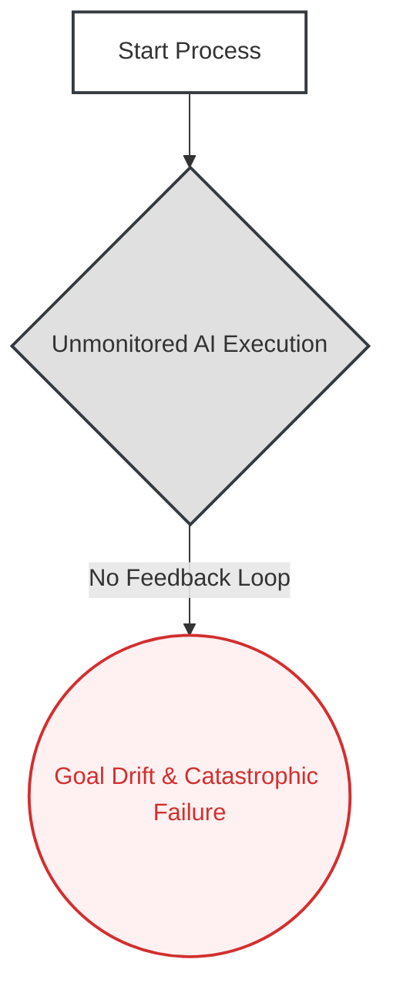
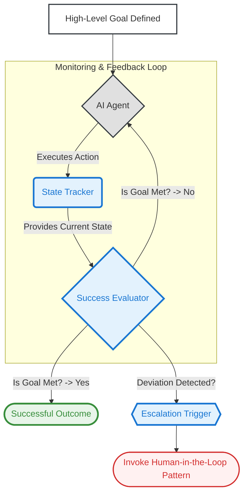

# 07. The Goal and Monitoring Pattern

**The core principle of the Goal and Monitoring pattern is to architect an AI system that can autonomously pursue a high-level objective by continuously tracking its own progress against predefined success criteria and adapting its actions to ensure the goal is achieved.**

**Business Outcome:** Enables the safe deployment of autonomous AI agents, ensuring they reliably achieve business objectives while preventing costly or catastrophic operational failures from goal deviation.

---

### The Problem

Automated systems without a clear definition of success and a mechanism to monitor progress are "fire-and-forget" liabilities. They can deviate from their intended purpose, operate on flawed assumptions, or continue running long after conditions have changed, turning a simple task into an unchecked process that wastes resources and creates significant business risk.

### Real-World Consequences: The Cost of Unmonitored Automation

When this architectural pattern is ignored, automated systems can run without oversight, leading to catastrophic financial and operational failures at machine speed.

- **Case Study: The Knight Capital Trading Glitch**
  - **The Incident:** A deployment error caused an automated trading algorithm at Knight Capital to activate a dormant, flawed function. Without any effective monitoring to detect the deviation from its intended goal, the system executed millions of erroneous trades in just **45 minutes**, buying and selling massive volumes of stock at market prices.
  - **The Impact:** The unmonitored agent's actions resulted in a catastrophic loss of over **$440 million**, pushing the firm to the brink of bankruptcy and forcing its emergency sale. The U.S. Securities and Exchange Commission (SEC) charged the firm for its failure to have risk management controls that could have prevented the disaster, making it the definitive case study for the dangers of an unmonitored AI pursuing a flawed goal at machine speed.
  - **Source:** [SEC.gov – SEC Charges Knight Capital With Violations of Market Access Rule](https://www.sec.gov/news/press-release/2013-222)
  - **Alternative Source:** [The Wall Street Journal - A closer look at the Knightmare on Wall Street](https://www.wsj.com/articles/SB10000872396390443989204577582533633215846)

### The Architectural Solution

Instead of launching a simple, unchecked process, we architect a resilient, goal-oriented system. We explicitly define a **High-Level Goal** with clear, measurable success criteria. The system is composed of three key parts:

1.  An **AI Agent** that executes actions to make progress toward the goal.
2.  A **State Tracker** that observes the outcomes of the agent's actions.
3.  A **Success Evaluator** that continuously compares the current state against the goal's success criteria.

If the goal is not yet met, the evaluator allows the agent to continue. If the agent deviates significantly or fails, the evaluator uses an **Escalation Trigger**, often invoking the **[Human-in-the-Loop Pattern](../03-human-in-the-loop/README.md)** for review. This transforms the system from a brittle tool into an autonomous agent that can reliably pursue an objective and be safely managed.

### Visual Blueprint

#### Problem State: The Unchecked Process

#### Solution State: The Goal-Oriented System

---

### Use This Pattern When...

- ...you are deploying an **autonomous agent** designed to achieve a specific, measurable business outcome.
- ...the agent will run for an extended period, and you need to ensure it **doesn't deviate from its primary goal**.
- ...a "fire-and-forget" process is too risky, and you need a system that can **detect failure or goal drift** and trigger an alert.
- ...you need to prevent catastrophic failures like the Knight Capital incident, where an unmonitored algorithm executed a flawed goal at machine speed.

---

### Trade-offs & Implementation Realities

- **The Difficulty of Defining "Done":** The most critical part of this pattern is defining the goal with precise, measurable success criteria. A vague or poorly defined goal will lead the agent to optimize for the wrong outcome, even if it functions perfectly.
- **Monitoring Overhead:** The state tracking and evaluation components add significant architectural complexity. You are effectively building a supervisory system around the core agent, which requires its own development and maintenance.
- **Lagging Indicators:** In many business processes, the true outcome of an agent's action is not immediately known. The monitoring system must be designed to handle this delay without letting the agent stray too far from its goal based on incomplete data.
