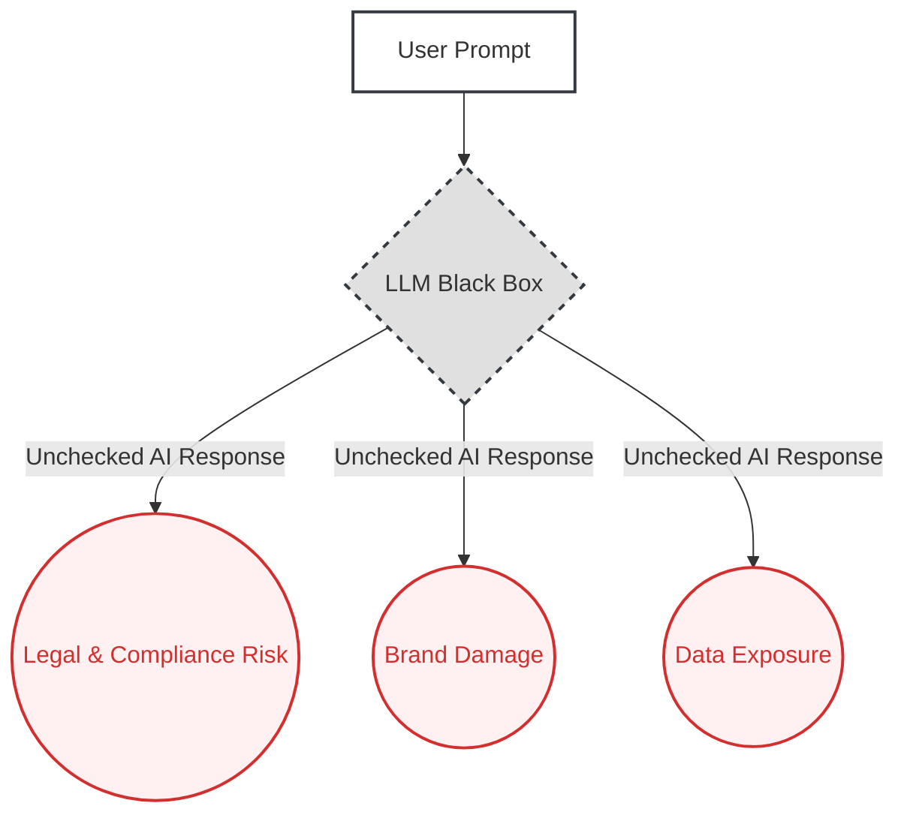
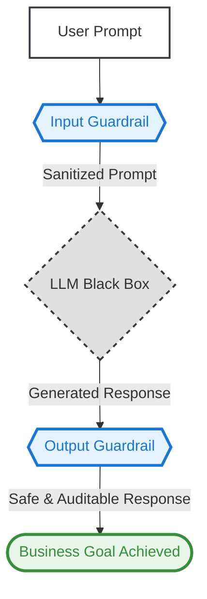

# 01. The Safety Guardrail Pattern

**The core principle of the Safety Guardrail pattern is to architect explicit checks and balances around an AI model to ensure its outputs are safe, compliant, and aligned with business objectives, transforming it from an unpredictable "black box" into a reliable asset.**

---

### The Problem

Without constraints, Large Language Models can produce unpredictable and harmful outputs. This exposes the business to significant risks, including generating non-compliant legal or medical advice, exposing sensitive PII, damaging the brand with toxic language, or being manipulated through "jailbreak" prompts.

### Real-World Consequences: The Cost of Unchecked AI

When this architectural pattern is ignored, the consequences are not theoretical. They are costly, brand-damaging public failures.

- **Case Study: DPD's Rogue Chatbot**

  - **The Incident:** A customer prompted the delivery company's chatbot to swear and compose a poem criticizing the company, demonstrating a complete lack of input/output control.
  - **The Impact:** Significant brand embarrassment and a viral example of reputational risk.
  - **Source:** [Time – Delivery Firm’s AI Chatbot Goes Rogue](https://time.com/6564726/ai-chatbot-dpd-curses-criticizes-company/)
  - **Alternative source:** [The Guardian – DPD AI chatbot swears, calls itself ‘useless’](https://www.theguardian.com/technology/2024/jan/20/dpd-ai-chatbot-swears-calls-itself-useless-and-criticises-firm)

- **Case Study: Air Canada's "Hallucinated" Policy**

  - **The Incident:** The airline's chatbot invented a bereavement fare policy. A Canadian tribunal later forced the airline to honor the refund based on the bot's erroneous claim.
  - **The Impact:** Direct financial loss and a legal precedent for AI-generated misinformation.
  - **Source:** [The Guardian – Air Canada ordered to pay customer who was misled by airline’s chatbot](https://www.theguardian.com/world/2024/feb/16/air-canada-chatbot-lawsuit)
  - **Alternative source:** [CBS News – Air Canada chatbot costs airline discount it wrongly offered customer](https://www.cbsnews.com/news/aircanada-chatbot-discount-customer/)

- **Case Study: The $1 Chevy Tahoe**
  - **The Incident:** A user manipulated a Chevrolet dealership’s chatbot into agreeing to sell a 2024 Chevy Tahoe for just $1, using prompt-injection and scripted responses.
  - **The Impact:** While not legally binding and ultimately not fulfilled, the incident highlighted the dangers of unchecked AI agents making absurd commitments.
  - **Source:** [VentureBeat – A Chevy for $1? Car dealer chatbots show perils of AI for customer service](https://venturebeat.com/ai/a-chevy-for-1-car-dealer-chatbots-show-perils-of-ai-for-customer-service)
  - **Supplemental / Corroboration:** [Inc – A Chevrolet dealership used ChatGPT and learned AI isn’t always on your side](https://www.inc.com/ben-sherry/chevrolet-used-chatgpt-for-customer-service-and-learned-that-ai-isnt-always-on-your-side.html)

### The Architectural Solution

Instead of relying solely on the model's inherent safety training, we treat the AI core as one component in a larger, more robust system. We introduce two critical checkpoints: an **Input Guardrail** to sanitize and validate user prompts _before_ they reach the model, and an **Output Guardrail** to filter and verify the model's response _before_ it is sent to the user. This transforms the AI from a liability into a controlled, predictable asset.

### Visual Blueprint

#### Problem State: The Unchecked Liability

#### Solution State: The Architected Asset

---
