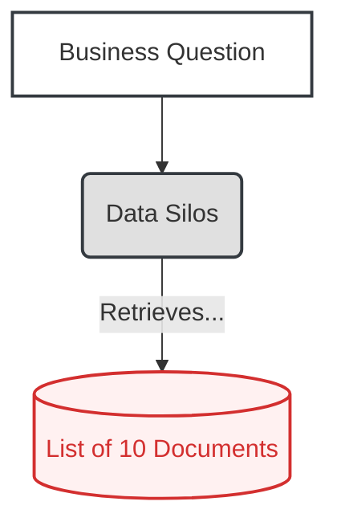
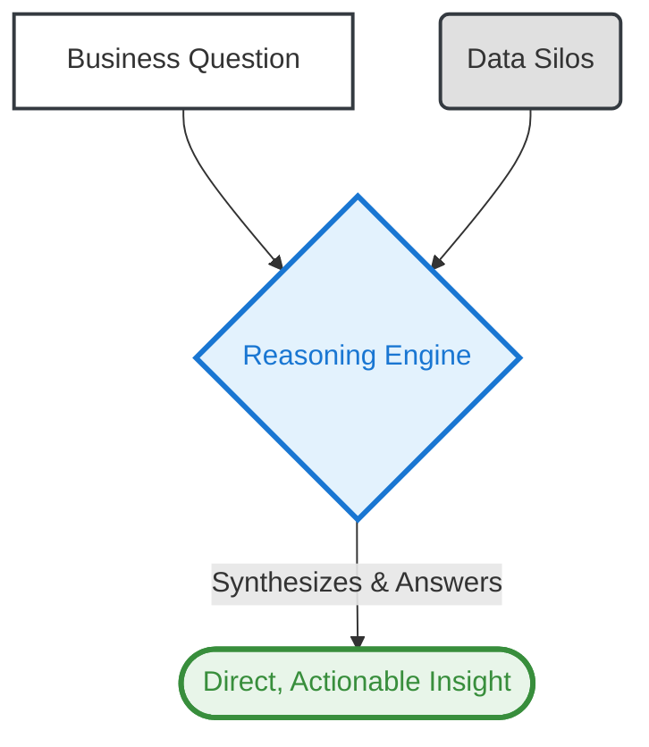

# 02. The Reasoning Engine Pattern

**The core principle of the Reasoning Engine pattern is to create an AI system that moves beyond simple document retrieval to synthesize information from multiple sources, providing direct, actionable answers to complex business questions.**

**Business Outcome:** Increases the ROI of existing data assets and boosts the productivity of knowledge workers by automating the manual synthesis of information.

---

### The Problem

Many expensive "AI" knowledge systems are just fancy search bars. They retrieve a list of documents, forcing users to still do the hard work of finding the actual answer. This delivers a low return on investment and fails to solve the core business problem: getting timely, accurate insights from a sea of data.

### Real-World Consequences: The High Cost of Manual Synthesis

- **Case Study: JPMorgan Chase's Contract Intelligence (COiN)**

  - **The Incident:** Legal and financial teams were required to manually review and interpret thousands of complex commercial loan agreements. This repetitive, labor-intensive process consumed over **360,000 work-hours annually** and was prone to costly human error in compliance.
  - **The Impact:** The COiN platform was developed to act as a reasoning engine, using AI to analyze and extract critical data from **12,000 documents** in mere seconds—a task that previously took weeks.
  - **Source:** [Medium - How JPMorgan Uses AI to Save 360,000 Legal Hours A Year](https://medium.com/@arahmedraza/how-jpmorgan-uses-ai-to-save-360-000-legal-hours-a-year-6e94d58a557b)

- **Case Study: JPMorgan Chase's Emerging Opportunities Engine**
  - **The Incident:** To identify clients for new equity offerings, investment bankers had to manually sift through vast amounts of client data and market signals. The process was slow, inconsistent, and risked missing key opportunities.
  - **The Impact:** The bank built an AI-powered reasoning engine that synthesizes historical client behavior and market data to identify and rank the best-matched clients for new deals. The system delivers direct, actionable recommendations, helping bankers close deals and secure new business much more efficiently.
  - **Source:** [DigitalDefynd - JP Morgan Using AI Case Study](https://digitaldefynd.com/IQ/jp-morgan-using-ai-case-study/)

### The Architectural Solution

Instead of just retrieving documents, we build a system with a **Reasoning Engine** at its core. This engine takes a user's business question, queries multiple data silos (documents, databases, APIs), and then synthesizes the findings into a single, direct, and actionable answer. It moves the cognitive load from the user to the system.

### Visual Blueprint

#### Problem State: The Document Chaser

#### Solution State: The Strategic Oracle

---

### Use This Pattern When...

- ...your end-users are **high-cost knowledge workers** (analysts, researchers, lawyers) and their time spent manually synthesizing information is a significant operational cost.
- ...the business objective is to get a **single, synthesized answer**, not a list of 10 documents that still require manual work.
- ...your critical knowledge is fragmented across **multiple data silos** (e.g., PDFs, databases, SharePoint) that need to be queried in concert.
- ...you need to justify an investment in AI by demonstrating a clear **productivity multiplier**, not just a better search bar.

---

### Trade-offs & Implementation Realities

- **"Garbage In, Garbage Out":** The quality of the synthesized answer is entirely dependent on the quality and accuracy of the underlying data sources. A reasoning engine can't fix a data quality problem; it can only expose it.
- **Cost & Complexity:** This is not a simple search index. A true reasoning engine involves significant data engineering to connect to silos and can incur higher costs due to more complex and numerous LLM calls.
- **Risk of Hallucination:** The synthesis step can introduce subtle misinterpretations or confident-sounding "hallucinations" that are not supported by the source documents. Traceability back to the source data is critical for validation.
