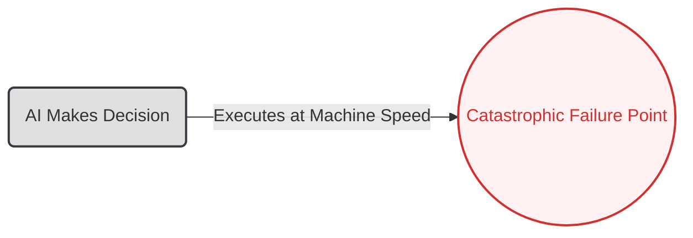

# 03. The Human-in-the-Loop Pattern

**The core principle of the Human-in-the-Loop pattern is to architect a strategic control point where a human expert reviews, approves, or modifies an AI-generated recommendation before it is executed, preventing automated failures in critical systems.**

**Business Outcome:** Mitigates the risk of catastrophic failures in high-stakes processes by ensuring critical decisions are validated by human expertise and accountability.

---

### The Problem

The rush for 100% automation creates brittle, high-risk systems. An AI making decisions at machine speed, without oversight, can turn a single error into a catastrophic failure, causing massive financial loss, operational disruption, or brand damage in seconds.

### Real-World Consequences: Dangerous AI Recommendations

- **Case Study: IBM Watson for Oncology's Dangerous Recommendations**

  - **The Incident:** IBM's flagship AI for healthcare, Watson for Oncology, was found to be providing unsafe and incorrect cancer treatment recommendations. The system was trained on a small number of synthetic cases and data from a single institution, leading it to suggest treatments that were medically inappropriate for real-world patients.
  - **The Impact:** The system's failures eroded trust in AI within the medical community and led to the eventual sale of IBM Watson Health after an estimated investment loss of over $4 billion. It highlighted that even with experts "in the loop," an AI's recommendations can be dangerously flawed if its training and logic are not transparent and verifiable.
  - **Source:** [Henrico Dolfing - Case Study: IBM Watson for Oncology Failure](https://www.henricodolfing.com/2024/12/case-study-ibm-watson-for-oncology-failure.html)
    [Harvard Ethics - Post-8 Abyss: Examining AI Failures and Lessons Learned](https://www.ethics.harvard.edu/blog/post-8-abyss-examining-ai-failures-and-lessons-learned)

- **Case Study: Amazon's AI Hiring System Gender Discrimination**

  - **The Incident:** Amazon created an AI tool to screen and rank job candidates. The model was trained on a decade of the company's own hiring data, which was heavily skewed toward male applicants. As a result, the AI learned to penalize resumes containing the word "women's" and systematically downgraded graduates from all-women's colleges.
  - **The Impact:** Amazon was forced to abandon the project after engineers could not eliminate the learned bias. The incident became a prominent example of how AI can perpetuate and scale historical biases, leading to significant reputational damage and highlighting the risk of automated decision-making in HR without rigorous human oversight.
  - **Source:** [Reuters - Amazon scraps secret AI recruiting tool that showed bias against women](https://www.reuters.com/article/us-amazon-com-jobs-automation-insight-idUSKCN1MK08G)
  - **Alternative source:** [BBC News - Amazon scrapped 'sexist AI' tool](https://www.bbc.com/news/technology-45809919)

- **Case Study: The Dutch SyRI Welfare Fraud Algorithm**
  - **The Incident:** The Netherlands deployed a secret, automated system called SyRI (System Risk Indication) to detect potential social welfare fraud. The algorithm analyzed personal data from multiple government agencies to create "risk profiles," but it was exclusively used in low-income neighborhoods with high immigrant populations and offered no transparency into how it reached its conclusions.
  - **The Impact:** A Dutch court ruled that the system was discriminatory and violated human rights under the European Convention on Human Rights, forcing the government to halt its use. The case set a major legal precedent that opaque, automated decision-making by governments is unlawful if it cannot be challenged or reviewed by a human, stigmatizing entire communities without due process.
  - **Source:** [AlgorithmWatch - SyRI in the Netherlands](https://algorithmwatch.org/en/syri-netherlands-algorithm/)
    [Human Rights Pulse - Dutch Court Finds SyRI Algorithm Violates Human Rights Norms in Landmark Case](https://www.humanrightspulse.com/mastercontentblog/dutch-court-finds-syri-algorithm-violates-human-rights-norms-in-landmark-case)

### The Architectural Solution

Instead of full automation, we design a resilient system that augments human expertise with AI. The AI is tasked with analysis and recommendation, not final execution. The **Human Review** step acts as a critical circuit breaker, ensuring that a human expert with real-world context makes the final, authoritative decision. This transforms the AI from a potential risk into a powerful, trustworthy co-pilot.

### Visual Blueprint

#### Problem State: The Brittle Workflow

#### Solution State: The Resilient System

---

### Use This Pattern When...

- ...the **cost of an automated error is unacceptably high**, whether in financial terms, data loss, or safety implications.
- ...an AI-driven action is **irreversible** (e.g., executing a financial trade, deleting customer data, deploying code to production).
- ...your process requires a clear **audit trail with human sign-off** for compliance or governance reasons.
- ...the task involves a high degree of ambiguity or context that still requires **expert human judgment** to make the final call.

---

### Trade-offs & Implementation Realities

- **The Speed vs. Safety Trade-off:** This pattern is a deliberate choice to sacrifice the speed of full automation for the safety of human oversight. It creates an intentional bottleneck to prevent high-speed automated errors.
- **Risk of "Rubber-Stamping":** If the AI's recommendations are correct 99% of the time, human reviewers can become complacent and approve suggestions without proper scrutiny. The review interface must be designed to counter this.
- **Operational Cost:** You are paying for an expert's time to review the AI's work. This operational cost must be justified by the high cost of the potential failure you are preventing.
