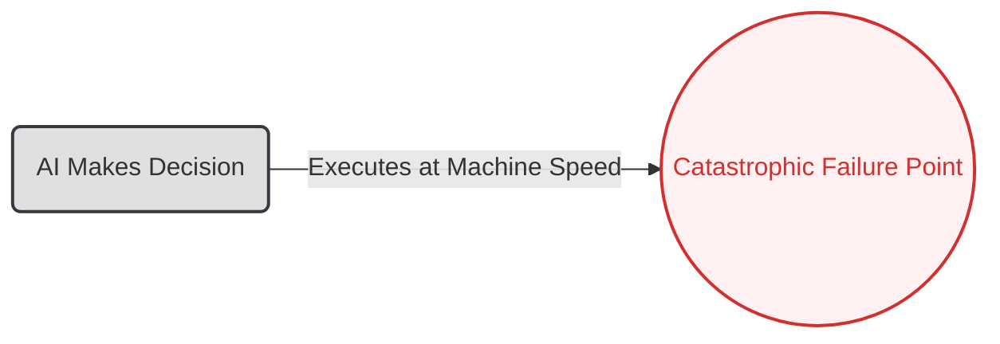
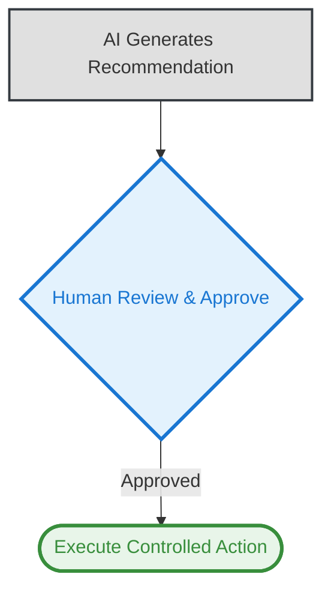

# 03. The Human-in-the-Loop Pattern

**The core principle of the Human-in-the-Loop pattern is to architect a strategic control point where a human expert reviews, approves, or modifies an AI-generated recommendation before it is executed, preventing automated failures in critical systems.**

---

### The Problem

The rush for 100% automation creates brittle, high-risk systems. An AI making decisions at machine speed, without oversight, can turn a single error into a catastrophic failure, causing massive financial loss, operational disruption, or brand damage in seconds.

### The Architectural Solution

Instead of full automation, we design a resilient system that augments human expertise with AI. The AI is tasked with analysis and recommendation, not final execution. The **Human Review** step acts as a critical circuit breaker, ensuring that a human expert with real-world context makes the final, authoritative decision. This transforms the AI from a potential risk into a powerful, trustworthy co-pilot.

### Visual Blueprint

#### Problem State: The Brittle Workflow

#### Solution State: The Resilient System

---
