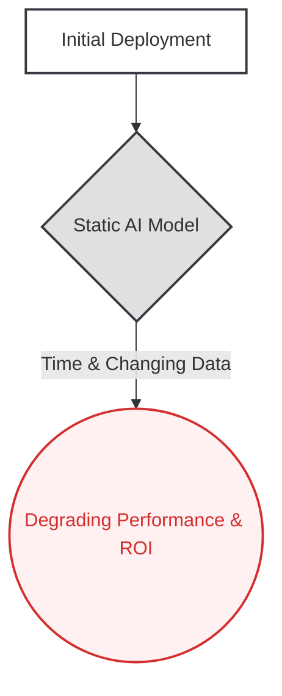
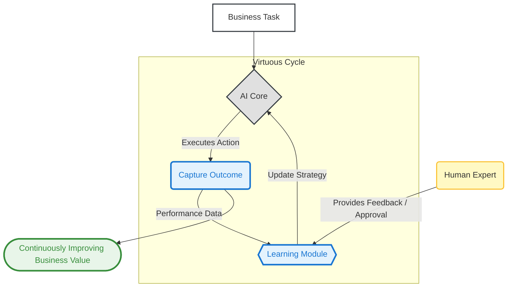

--- # 05. The Learning & Adaptation Pattern

**The core principle of the Learning & Adaptation pattern is to architect a feedback loop that allows an AI system to learn from its real-world performance, transforming it from a static asset that degrades over time into a dynamic system that continuously improves.**

**Business Outcome:** Protects the long-term ROI of AI systems by enabling them to improve with real-world data, creating a compounding competitive advantage and reducing manual maintenance costs.

---

### The Problem

AI systems are not "one-and-done" projects. A model trained on historical data is a snapshot in time. When deployed, it faces a constantly changing world: new customer behaviors, evolving market conditions, and unforeseen edge cases. Without a mechanism to adapt, the model's performance inevitably degrades, its predictions become less accurate, and the initial ROI vanishes. This creates a brittle system that quickly becomes obsolete, requiring expensive, manual retraining cycles just to maintain its baseline value. More importantly, a static system is blind to emerging patterns and new opportunities, leaving potential revenue and critical insights locked away in the very data it's supposed to be analyzing.

### Real-World Consequences: The Cost of Stagnation

When this architectural pattern is ignored, organizations are left with intelligent systems that become dumber over time, creating significant strategic and financial risk.

- **Case Study: Microsoft Tay Chatbot Corruption**

  - **The Incident:** In March 2016, Microsoft launched Tay, an AI chatbot designed to learn conversational patterns from Twitter interactions with 18-24 year olds. Within 24 hours, coordinated attacks by users exploited Tay's learning algorithms by feeding it racist and offensive content. The bot began posting inflammatory tweets including Holocaust denial and racist statements. Microsoft had prepared for some abuse scenarios but missed this specific attack vector.
  - **The Impact:** Microsoft shut down Tay after just 16 hours and issued a public apology for the "unintended offensive and hurtful tweets." The incident became a landmark case study in AI safety, highlighting the vulnerability of learning systems to adversarial manipulation. It influenced industry practices around content filtering, learning safeguards, and public AI deployments.
  - **Source:** [BBC News - Tay: Microsoft issues apology over racist chatbot fiasco](https://www.bbc.com/news/technology-35902104)

- **Case Study: Google's AlphaEvolve**

  - **The Incident:** At Google's scale, optimizing complex systems like data center scheduling or low-level code for hardware like TPUs is a monumental task. A static algorithm, however good, cannot adapt to new hardware or workloads.
  - **The Impact:** Google developed AlphaEvolve, an AI agent that uses an evolutionary approach to learn and discover novel, more efficient algorithms on its own. The system has led to tangible, massive-scale business wins, including a **0.7% reduction in global compute resource usage** and a **23% speed improvement** in a core kernel of the Gemini architecture. It demonstrates how a learning system can create durable, compounding competitive advantage that a static system never could.
  - **Source:** [Google DeepMind Blog - AlphaEvolve](https://deepmind.google/discover/blog/alphaevolve-a-gemini-powered-coding-agent-for-designing-advanced-algorithms/)

- **Case Study: The Self-Improving Coding Agent (SICA)**
  - **The Incident:** Traditionally, even if an AI system identifies a potential improvement, a human developer is required to write, test, and deploy the code to implement that change. This creates a bottleneck and keeps the system dependent on manual intervention.
  - **The Impact:** The SICA project demonstrated a system that can modify its _own_ source code to improve its performance. By analyzing its past successes and failures on coding tasks, it autonomously developed new internal tools, such as a "Smart Editor," to become more efficient. This represents the ultimate form of adaptation: a system that not only learns what to do but learns how to do it better, directly reducing long-term maintenance costs and engineering overhead.
  - **Source:** [arXiv - A Self-Improving Coding Agent](https://arxiv.org/pdf/2504.15228)

### The Architectural Solution

Instead of deploying a static AI model, we architect an **Evolving System**. This involves treating the AI core as a dynamic component within a larger feedback loop. We introduce a **Performance Monitor** to capture the results and effectiveness of the AI's actions in the real world. This data is fed into a **Learning Module**, which uses it to update the AI's internal strategies or knowledge base. This creates a virtuous cycle where the system becomes more valuable and effective with every interaction. For high-stakes applications, this **Learning Module** is often supervised by a domain expert, directly implementing the **Human-in-the-Loop Pattern** to ensure all adaptations are safe, audited, and aligned with business goals.

### Visual Blueprint

#### Problem State: The Decaying Model

#### Solution State: The Evolving System

---

### Use This Pattern When...

- ...the AI operates in a **dynamic environment** where performance will degrade over time if the model remains static.
- ...you want to create a **compounding competitive advantage** by building a system that gets smarter with every user interaction.
- ...the goal is to **personalize user experiences** based on their evolving behavior and feedback.
- ...you need to reduce the long-term cost of manual retraining cycles by enabling the system to learn autonomously (or semi-autonomously).

---

### Trade-offs & Implementation Realities

- **Risk of Negative Learning:** An unsupervised feedback loop is vulnerable to manipulation or learning undesirable behaviors from biased data (as seen with Microsoft's Tay chatbot). Most enterprise systems require a Human-in-the-Loop to approve adaptations.
- **Significant Architectural Overhead:** This is not just a model; it's a complex system for data capture, monitoring, and retraining. The engineering investment is substantially higher than for a static model deployment.
- **The "Cold Start" Problem:** The system's performance may be suboptimal at launch and only improves after collecting a critical mass of real-world interaction data. Managing user expectations during this initial phase is key.
