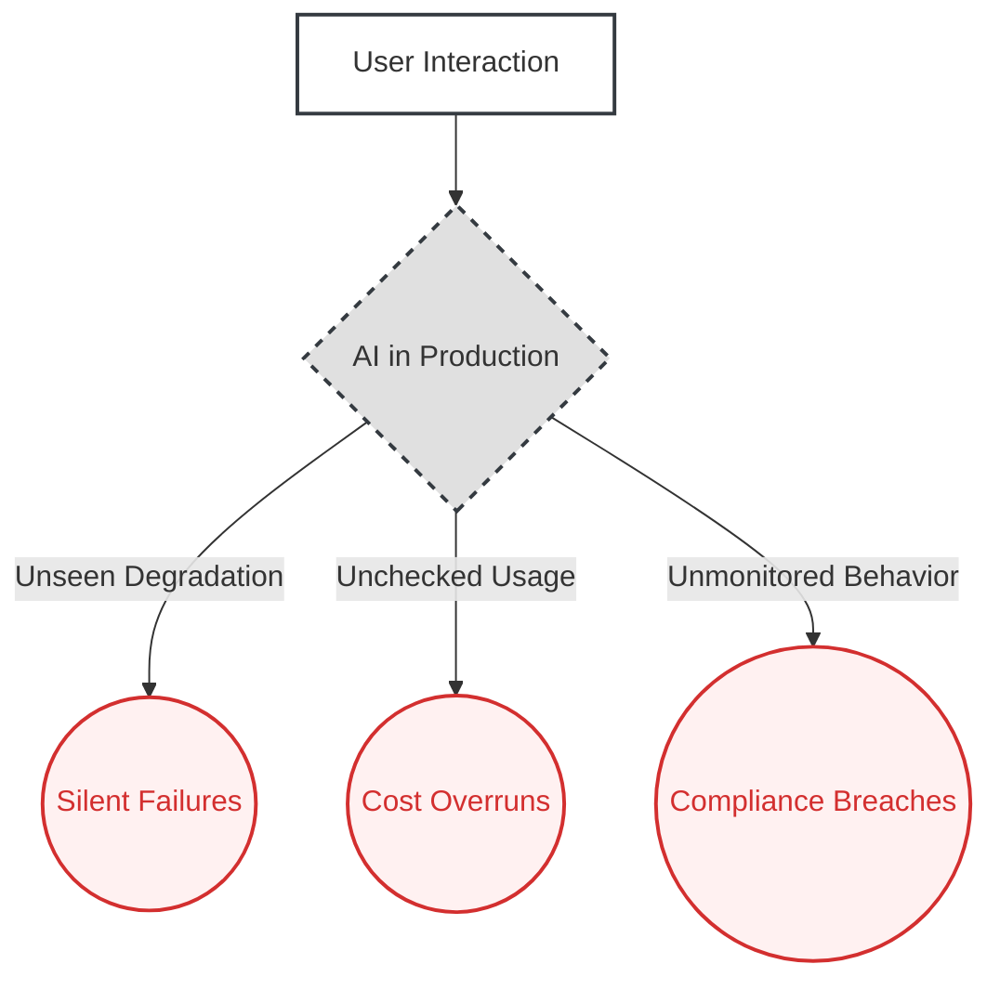
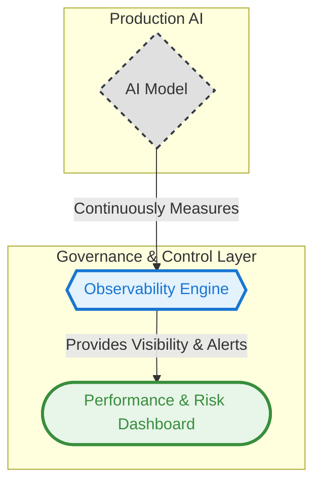

# 06. The AI Observability Pattern

**The core principle of the AI Observability pattern is to architect a system of continuous measurement that provides deep visibility into a production AI's operational health, cost, and behavior, transforming it from an unmanaged black box into a governable and reliable business asset.**

---

### The Problem

Traditional software is tested once and deployed. AI systems are different. They are probabilistic, their performance can degrade silently over time as the real world changes, and their costs can spiral out of control if not managed.

Deploying an AI without a robust monitoring framework is like flying a plane without an instrument panel. The system might appear to be working, but it could be silently failing—giving plausible but incorrect answers, becoming a financial black hole through inefficient resource use, or slowly drifting into non-compliant or brand-damaging behavior. This creates a massive, unmanaged risk for the business.

While the Goal-Oriented Pattern (#7) focuses on an agent's ability to autonomously achieve a business objective, the AI Observability Pattern focuses on the operational governance required to ensure any production AI system is safe, cost-effective, and reliable.

### Real-World Consequences: The High Cost of "Silent Failure"

When this architectural pattern is ignored, the consequences are not sudden crashes but slow, costly degradations that erode value and introduce risk.

**(Placeholder: Research and add a strong, real-world case study here. Example: A company that experienced significant financial loss or brand damage due to unmonitored AI cost or quality degradation.)**

### The Architectural Solution

Instead of a "launch and pray" approach, we architect a robust **Observability Engine** that continuously observes and measures the AI system in production. This engine acts as a mission control for the AI, tracking three critical streams of information: **Performance & Quality** (Is it accurate and helpful?), **Risk & Compliance** (Is it safe and compliant?), and **Cost & Efficiency** (Is it financially viable?). The insights from this engine are fed into a **Performance & Risk Dashboard**, giving the CTO and business leaders the visibility needed to govern the system effectively.

### Visual Blueprint

#### Problem State: The Unmanaged Black Box

#### Solution State: The Observable System

---

### Use This Pattern When...

- ...you are deploying any AI system into a production environment.
- ...the ongoing operational cost of the AI is a significant concern.
- ...the quality and compliance of the AI's output can change over time due to new data or regulations.
- ...you need to provide business stakeholders with a clear dashboard on the health and ROI of your AI investment.
