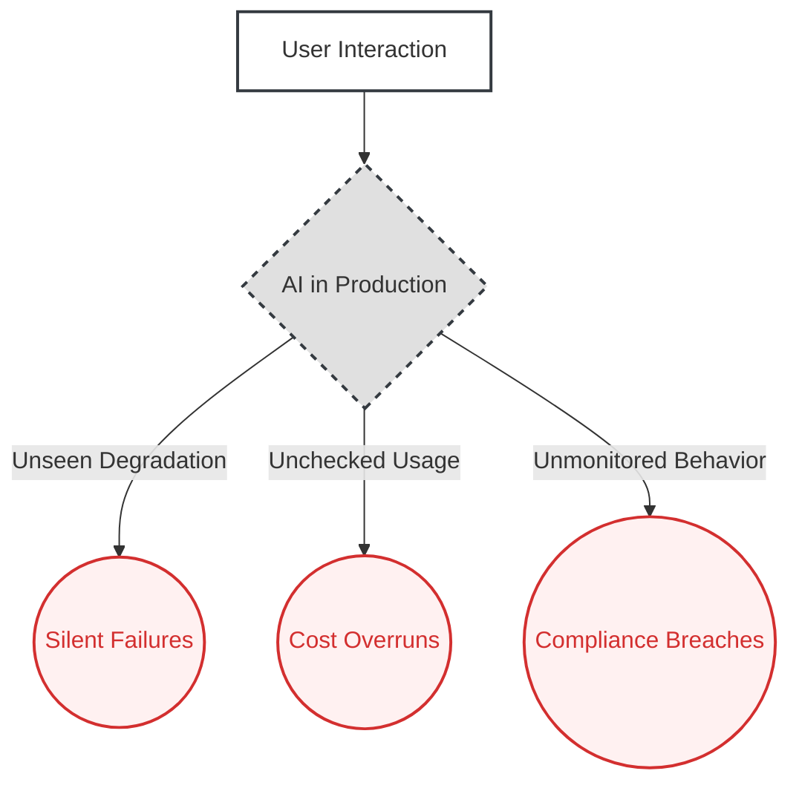
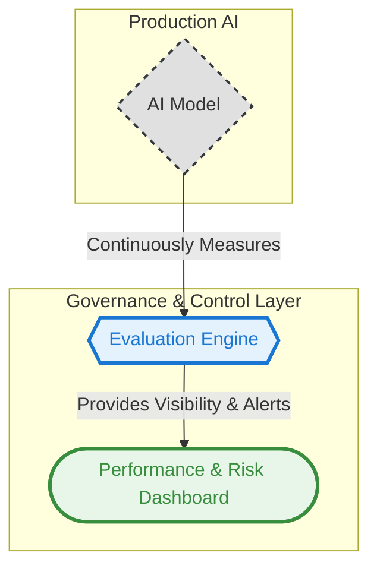

# 06. The Evaluation and Monitoring Pattern

**The core principle of the Evaluation and Monitoring pattern is to architect a system of continuous measurement that governs a production AI, transforming it from an unpredictable liability into a transparent and manageable business asset.**

---

### The Problem

Traditional software is tested once and deployed. AI systems are different. They are probabilistic, their performance can degrade silently over time as the real world changes, and their costs can spiral out of control if not managed.

Deploying an AI without a robust monitoring framework is like flying a plane without an instrument panel. The system might appear to be working, but it could be silently failing—giving plausible but incorrect answers, becoming a financial black hole through inefficient resource use, or slowly drifting into non-compliant or brand-damaging behavior. This creates a massive, unmanaged risk for the business.

### Real-World Consequences: The High Cost of "Silent Failure"

When this architectural pattern is ignored, the consequences are not sudden crashes but slow, costly degradations that erode value and introduce risk.

*   **Scenario: The Silent Compliance Drift**
    *   **The Incident:** A wealth management firm deploys an AI to provide initial advice to clients. The bot is trained on historical market data. Over the next six months, new market conditions and regulations emerge. The AI's advice, while still fluent and confident, becomes increasingly outdated and misaligned with current compliance requirements. This "concept drift" goes undetected because the system has no mechanism to evaluate the ongoing quality of its answers against the changing external world.
    *   **The Impact:** The firm is exposed to significant compliance risk and potential financial liability for providing poor advice. The ROI of the project turns negative as the cost of potential fines and reputational damage outweighs the initial efficiency gains.

*   **Scenario: The Financial Drain of the Leaky Model**
    *   **The Incident:** A company uses a generative AI to create personalized marketing copy. A bug in a new version of the underlying model causes it to use far more computational resources (tokens) for each generation than the previous version. Because there is no cost monitoring in place, the issue goes unnoticed for a full billing cycle.
    *   **The Impact:** The company receives a shockingly high bill from their AI service provider, turning a profitable initiative into a significant financial loss. The budget for the project is exhausted, forcing a halt to a critical marketing campaign.

### The Architectural Solution

Instead of a "launch and pray" approach, we architect a robust **Evaluation Engine** that continuously observes and measures the AI system in production. This engine acts as a mission control for the AI, tracking three critical streams of information: **Performance & Quality** (Is it accurate and helpful?), **Risk & Compliance** (Is it safe and compliant?), and **Cost & Efficiency** (Is it financially viable?). The insights from this engine are fed into a **Performance & Risk Dashboard**, giving the CTO and business leaders the visibility needed to govern the system effectively.

### Visual Blueprint

#### Problem State: The Unmanaged Black Box

#### Solution State: The Governed Asset

