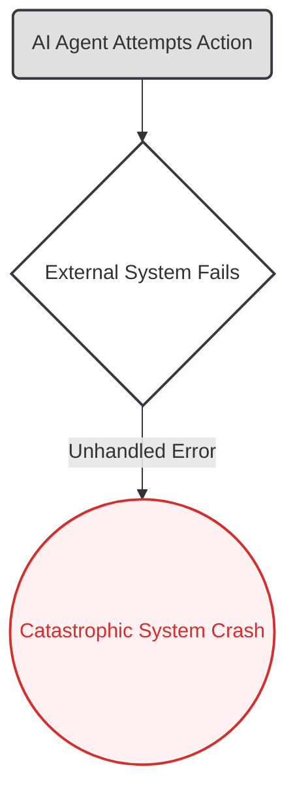
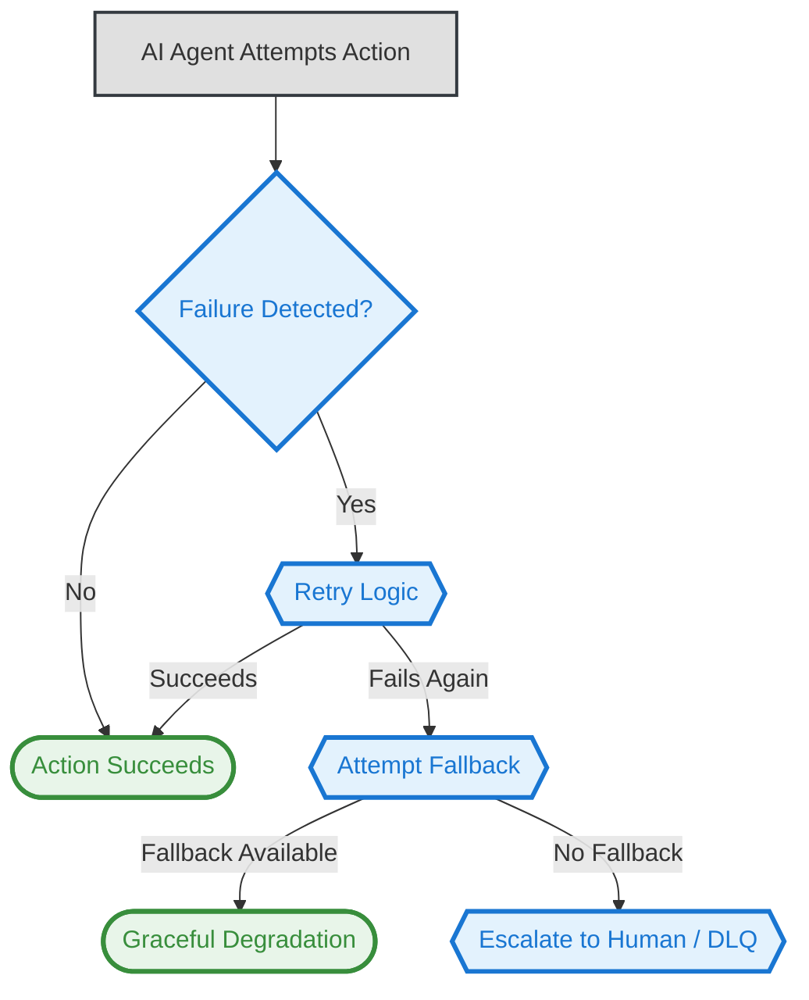

# 08. The Resilient Workflow Pattern

**The core principle of the Resilient Workflow pattern is to architect a system that anticipates and gracefully manages failures, ensuring that an AI agent can recover, retry, or fail safely without causing catastrophic operational disruption.**

**Business Outcome:** Increases operational stability and user trust by ensuring AI systems can handle predictable failures gracefully, preventing brittle automation from causing costly downtime and data corruption.

---

### The Problem

Many AI systems are architected with a critical flaw: they are designed only for the "happy path." This creates brittle, "glass cannon" systems that shatter the moment they encounter a predictable, real-world failure: a temporary network outage, a rate-limited API, or a single piece of corrupted data. The result is not just a single failed transaction, but a cascade of costly business problems: operational downtime, corrupted data pipelines, and a complete loss of business trust. Without resilience, a powerful AI innovation quickly becomes an unreliable—and expensive—liability.

### Real-World Consequences: The Cost of Brittle Automation

When this architectural pattern is ignored, systems break in predictable and damaging ways.

- **Case Study: The Boeing 737 MAX MCAS System Failures**
  - **The Incident:** The 737 MAX's MCAS flight control system was designed to automatically push the aircraft's nose down to prevent a stall. However, the system was designed with no resilience; it relied on a single angle-of-attack sensor. When this single sensor failed, it provided erroneous data, causing the MCAS to repeatedly and powerfully activate, overwhelming the pilots.
  - **The Impact:** The system's brittle, non-resilient design, which could not gracefully handle a single point of failure, was a primary cause of two crashes (Lion Air Flight 610 and Ethiopian Airlines Flight 302) that killed 346 people. The entire 737 MAX fleet was grounded for 20 months, costing Boeing over $20 billion in fines and losses and destroying public trust.
  - **Source:** [https://en.wikipedia.org/wiki/Boeing_737_MAX_groundings](https://en.wikipedia.org/wiki/Boeing_737_MAX_groundings)
  - **Alternative Source:** [https://en.wikipedia.org/wiki/Maneuvering_Characteristics_Augmentation_System](https://en.wikipedia.org/wiki/Maneuvering_Characteristics_Augmentation_System)

### The Architectural Solution

Instead of assuming a "happy path," we architect for failure as a predictable event. The solution is to design a dedicated **Resilience Layer** that decouples the AI agent's core logic from the complexities of error handling. This layer acts as an intelligent supervisor, implementing established enterprise patterns:

1.  **Error Detection & Isolation:** It uses mechanisms like timeouts and **Circuit Breakers** to detect when a dependent service is failing and temporarily stop sending requests, preventing cascading failures.
2.  **State Management:** It ensures that the agent's state is persisted before critical operations, allowing for a clean rollback to a known-good state if an error occurs.
3.  **Recovery Orchestration:** It orchestrates a multi-stage recovery process, moving from simple, low-cost strategies to more complex interventions as needed.

This transforms the AI from a brittle tool into a robust, fault-tolerant, and production-ready asset.

### Key Resilience Strategies

A truly resilient system applies different recovery strategies based on the nature and severity of the failure:

- **Retry Logic:** For transient, temporary errors (e.g., a brief network blip). The system automatically retries the action, often with an exponential backoff (waiting progressively longer between retries). This is the first line of defense.
- **Fallback Systems:** For more persistent failures (e.g., a primary database is down). The system redirects the request to a secondary, perhaps less-capable, system (e.g., a read-only cache or a simpler AI model). This ensures graceful degradation of service instead of a complete outage.
- **Dead-Letter Queue & Escalation:** For catastrophic or unexpected failures (e.g., a corrupted data payload that cannot be processed). The failed task is moved to a "dead-letter queue" for later manual inspection by engineers, and an alert is triggered to notify a human operator. This prevents a single bad request from halting the entire system.

### Visual Blueprint

#### Problem State: The Brittle Workflow

#### Solution State: The Resilient System

---

### Use This Pattern When...

- ...your AI agent depends on **external APIs or services** that are outside of your control and may be unreliable.
- ...the system must process large batches of data where a **single corrupted file cannot be allowed to halt the entire job**.
- ...**graceful degradation of service** is preferable to a complete system crash during a partial outage.
- ...you are building a production-grade system where reliability and fault tolerance are non-negotiable requirements.

---

### Trade-offs & Implementation Realities

- **Significant Architectural Complexity:** Building a truly resilient system is much more complex than a simple "happy path" workflow. The logic for retries, fallbacks, and escalations adds considerable engineering overhead.
- **Risk of Masking Deeper Issues:** A well-implemented retry logic can sometimes hide a chronic problem in a downstream service. If an API is consistently failing, retrying might keep the system running, but it doesn't fix the root cause.
- **Cost of Redundancy:** Fallback systems are, by definition, redundant infrastructure that must be built and maintained. The level of investment in resilience must be proportional to the business cost of a system failure.
